* Login view

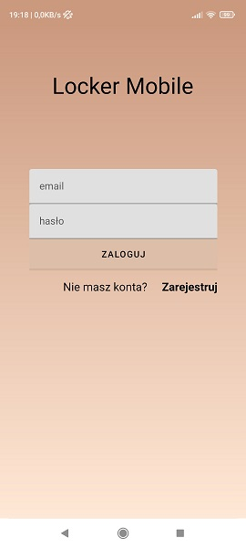
* Register view

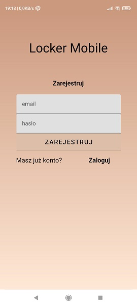
* New account created

* Main view

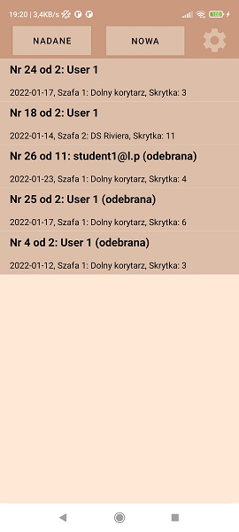
* Open locker to receive

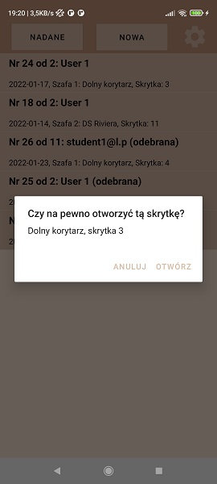
* Receive parcel view

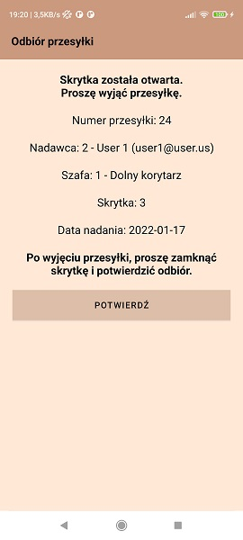
* Parcel received

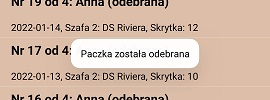
* Sent parcels

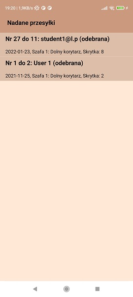
* Select recipient

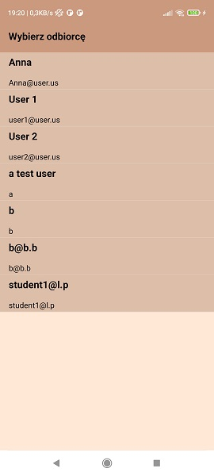
* Select box

* Select locker

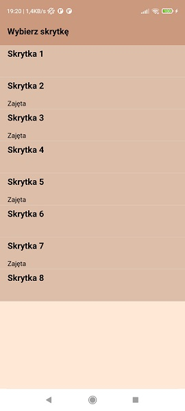
* Confirm locker opening

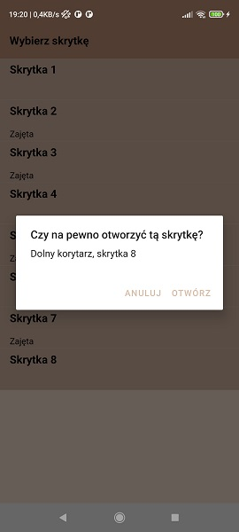
* Put parcel in locker

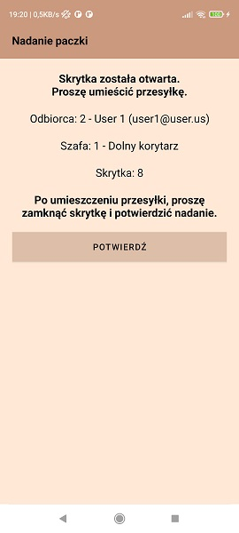
* Give access to recipient

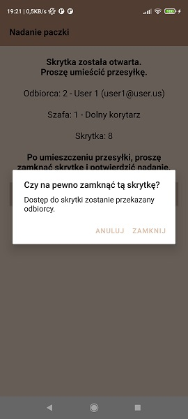
* Settings view

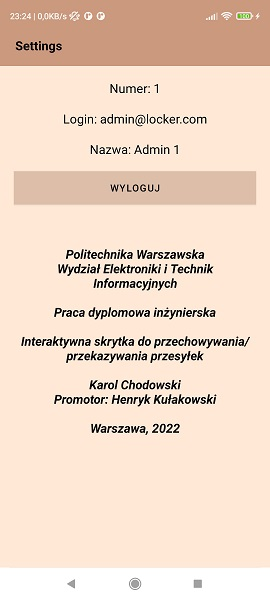
* Server connection error

