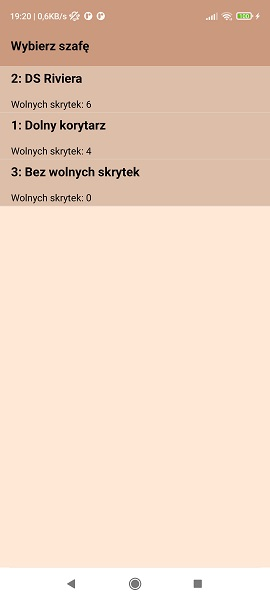

* Login view

* Register view

* New account created

* Main view

* Open locker to receive

* Receive parcel view

* Parcel received

* Sent parcels

* Select recipient

* Select box

* Select locker

* Confirm locker opening

* Put parcel in locker

* Give access to recipient

* Settings view

* Server connection error

